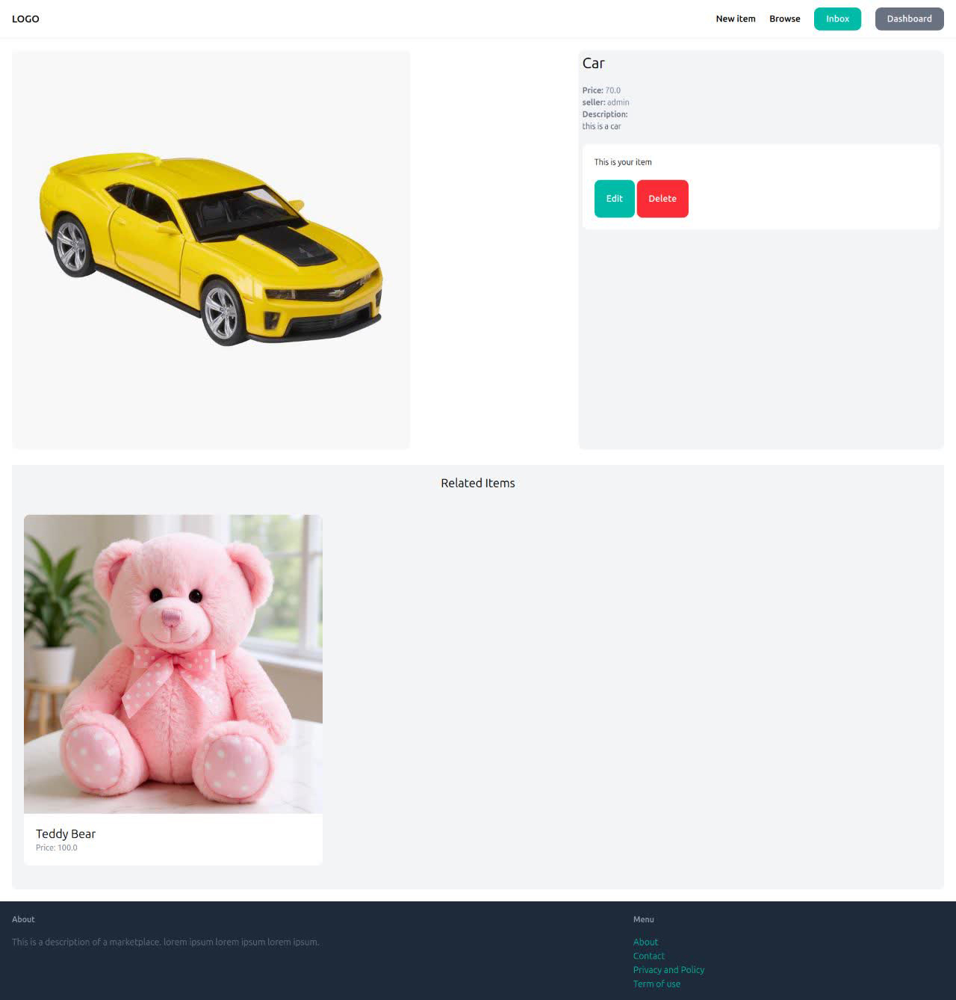

# 🛒 Marketplace

A full-stack marketplace web application where users can register, upload products, and communicate with sellers through a built-in chat system.

Built with Django and designed to simulate a modern online marketplace experience. 🚀

## ✨ Features

* 🔐 User Authentication

  * Register new accounts
  * Login & logout system

* 📦 Product Management

  * Upload products with images
  * Add product descriptions and prices
  * Edit and delete your own products

* 💬 Chat System

  * Contact sellers directly
  * Built-in messaging panel between buyers and sellers

* 🛍 Marketplace Browsing

  * Browse newest items
  * View detailed product pages
  * Explore related products

* 🗂 Categories

  * Organize products by category
  * Easy navigation and browsing

## 📸 Screenshots

### Homepage

.jpg)

### Product Page



## 🛠 Tech Stack

* Python
* Django
* HTML
* Tailwindcss
* SQLite

## ⚙ Installation

```bash
# Clone the repository
git clone https://github.com/Parsa03/Marketplace.git

# Move into the project directory
cd Marketplace

# Create virtual environment
python -m venv venv

# Activate virtual environment

# Windows
venv\Scripts\activate

# Linux / macOS
source venv/bin/activate

# Install dependencies
pip install -r requirements.txt

# Run migrations
python manage.py migrate

# Start the server
python manage.py runserver
```

## 🚀 Future Improvements

* ❤️ Wishlist / Favorites
* 🔍 Search and filtering
* 📱 Better responsive design
* 💳 Online payments
* 🔔 Notifications system

---

⭐ If you like the project, feel free to star the repository. A tiny yellow star powers developers better than coffee sometimes.
